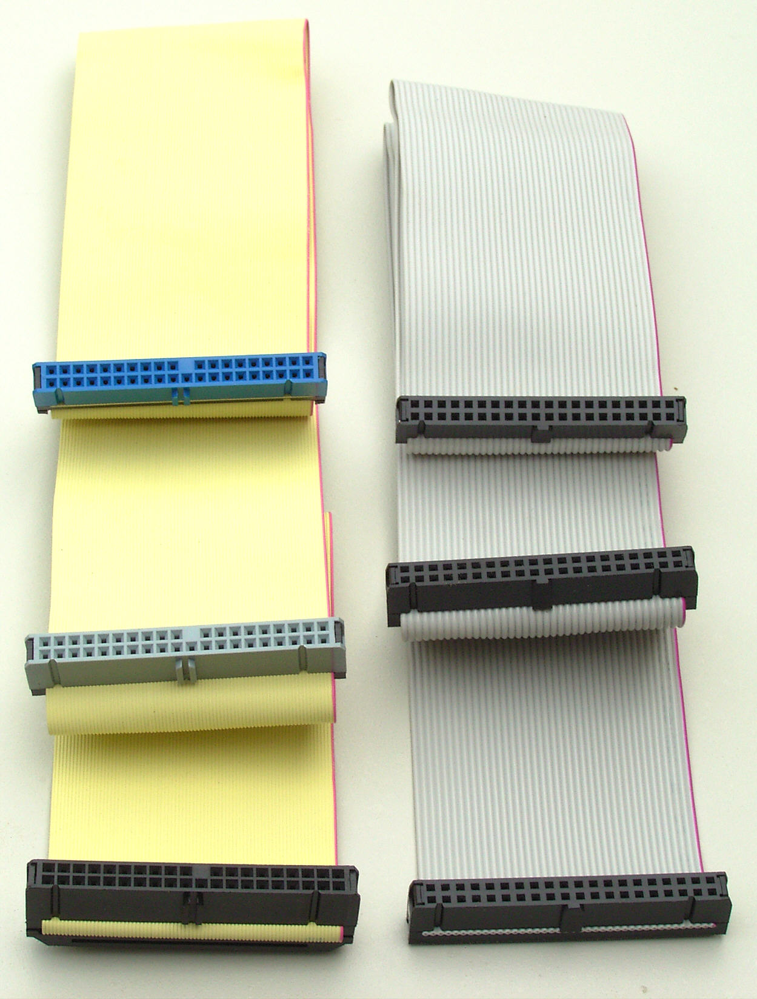
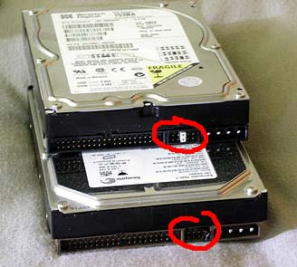
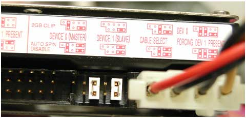

Gebruik voor dit experiment de (lege) Gen1- en Gen2-machines

Experiment:

- Maak zowel een Gen1- als Gen2-VM
- Voeg (indien mogelijk) IDE- en SCSI-controllers toe
- Verwijder IDE- en SCSI-controllers
- Voeg disks of optische stations (CD/DVD) toe aan elke controller
- Verwijder of verplaats disks of optische stations

Wat op moet vallen:

- Elke IDE-controller kan maximaal 2 drives aansturen
- Een SCSI-controller kan meerdere drives aansturen

> Met de flat-cables die IDE-apparaten gebruiken, konden maximaal 2 apparaten aan een 1 disk-controller aangesloten worden. Op de hard disks en CD/DVD-roms kon met jumper-settings een apparaat als *master* of *slave* ingesteld worden.

