# Gen1- VS Gen2-VM's
In deze oefening doen we dit experiment:

- Maak een nieuwe generatie 1 VM
- Maak een nieuwe generatie 2 VM
- Vergelijk de instellingen
- Vergelijk de *bootscreens*

# Propere lei
Voor we beginnen verwijderen we eerst alle vorige machines. Dit is niet noodzakelijk maar het is nooit slecht om wat aandacht te hebben voor een ordelijke mappenstructuur.

Machines kan je verwijderen vanuit `virtmgmt.msc`:

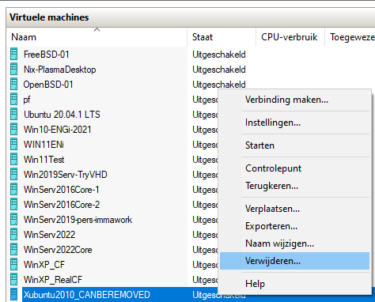

Maar wat je zal zien is dat er mogelijk toch nog bestanden blijven rondslingeren zoals de VM-configuratiebestanden.

Het zou onhandig zijn als b.v. een `.iso`-bestand dat gekoppeld was, ook mee zou verwijderd worden!

Controleer dus best altijd in Verkenner of in Powershell of je zelf nog bestanden mag weggooien!

Hier zie je b.v. bestanden die een aantal van mijn experimenten zijn blijven staan maar zeker weg mogen!

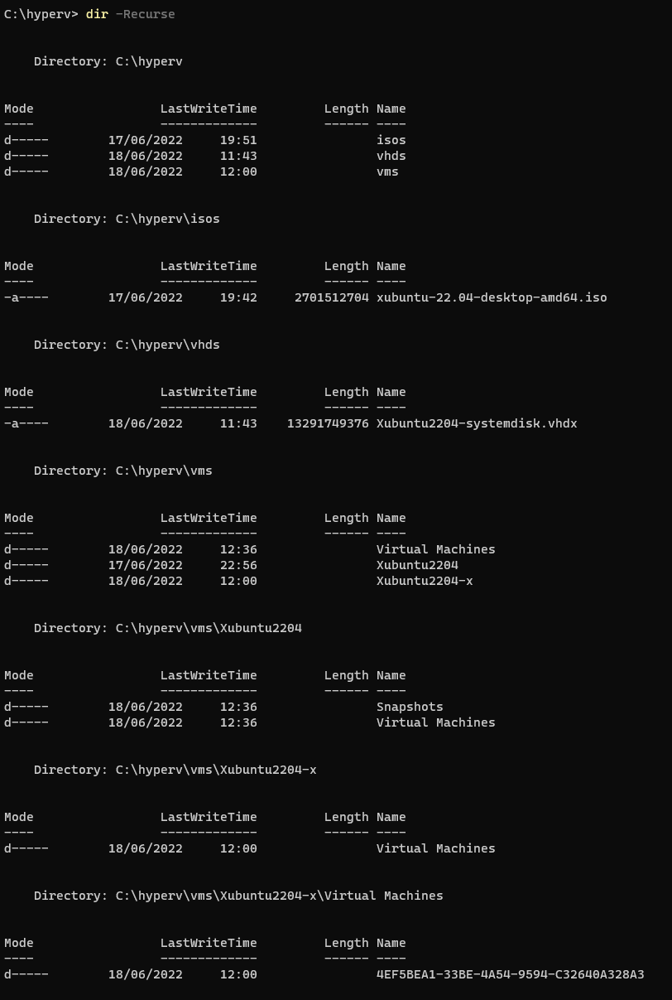

# Instellingen
We maken 2 nieuwe VM's, 1 van elke generatie. Voor het gemak voegen we geen disks of netwerkverbindingen toe.

Nadien heb ik deze bestanden:

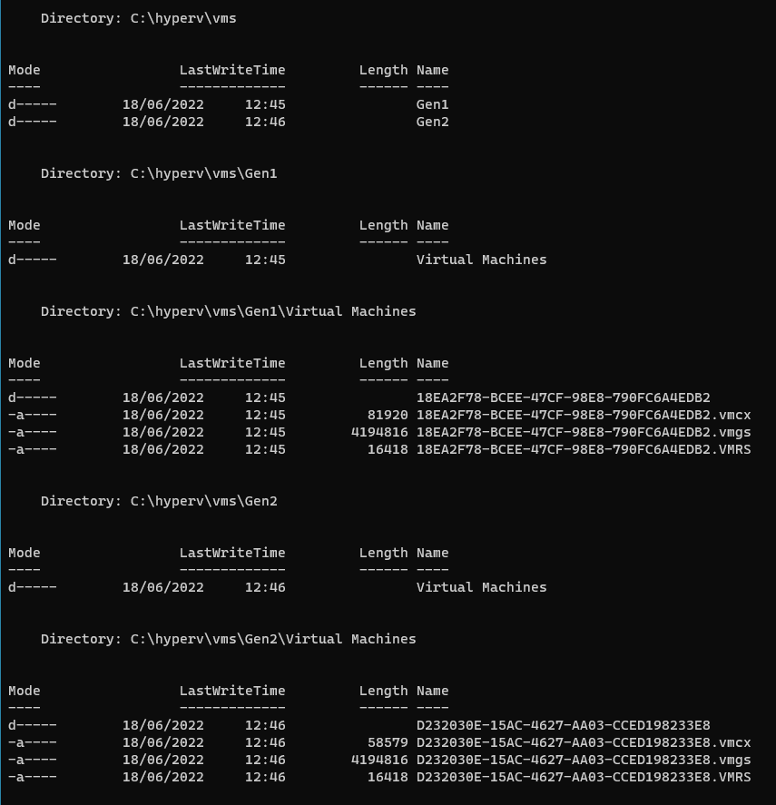

We gaan nu de instellingensmogelijkheden van beide VM's vergelijken.
Merk op dat in de volgende screenshots de instellingen **BIOS** en **firmware** geselecteerd zijn.

De Gen1-settings en BIOS:

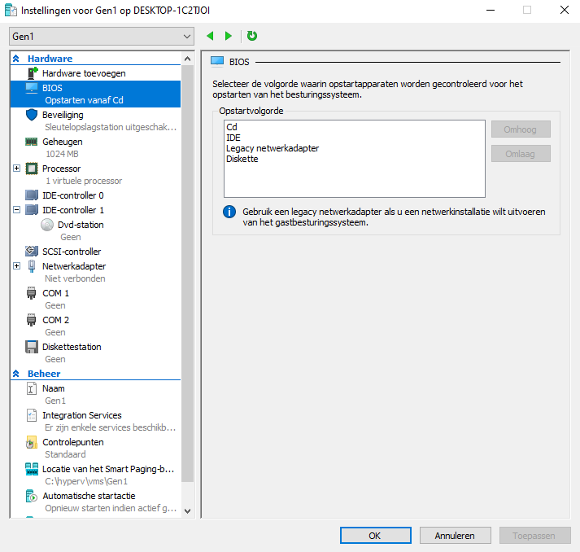

De Gen2-settings en Firmware (UEFI):

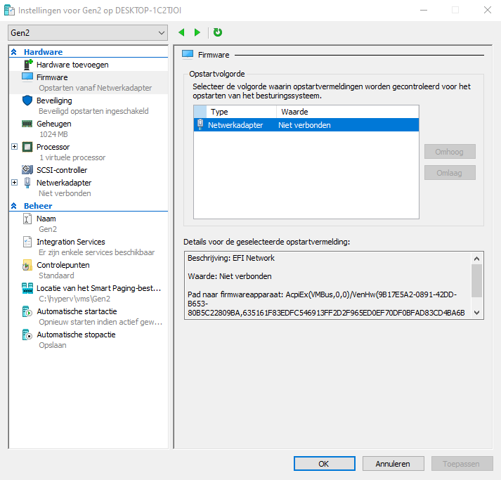

Bij de Gen2 is er nog een extra *Beveiliging*-instelling die ook met UEFI te maken heeft:

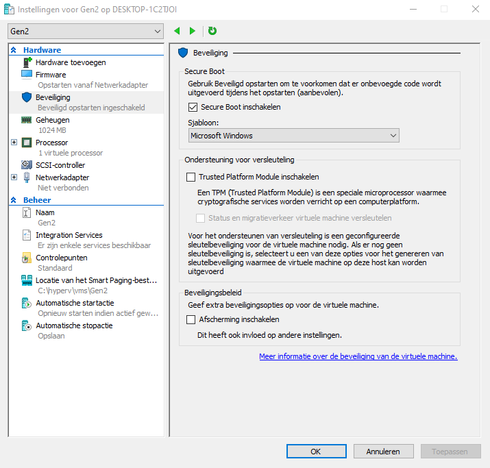

Wat kunnen we hier zoal uit leren?

We zien dat we zowel in het BIOS als in het UEFI de **bootvolgorde** kunnen instellen. Dit is belangrijk als in een systeem meerdere bootable disks aanwezig zijn.

Zowel een BIOS- als een UEFI-systeem kunnen zelfs van het netwerk opstarten (**network-boot**). Deze manier wordt in vele organisaties waar vele werkstations aanwezig zijn, gebruikt om van op afstand nieuwe OS's te installeren. In de UEFI-versie is deze functionaliteit weliswaar sterk geupdated.

Het is een recente ontwikkeling (die met Windows 11 nog meer bekendheid heeft gekregen) dat er meer belang wordt gehecht **de beveiliging van de bootloaders** (zoals GRUB dat Linux-systemen vaak gebruiken) **en het OS**. Met een **TPM** (Trusted Platform Module) zitten er **cryptografische functies** in de firmware, zodat bij het opstarten een **(met een sleutel beveiligde) hash** van het OS of de bootloader kan berekend worden. Zo kunnen we beter detecteren wanneer een hacker andere (OS/bootloader-)software heeft geïnstalleerd. Een TPM kan ook gezien worden als een relatief **veilige opslagplaats voor cryptografische sleutels**.

We kunnen van Hyper-V ook leren dat zelfs Gen1-machines een zogenaamd **sleutelstation** ondersteunen maar we lezen al meteen dat dit onderdeel mogelijk zal worden verwijderd uit een volgende versie van Hyper-V:

Wanneer we er op klikken, zien we een extra **Sleutelopslagstation** dat wordt toegevoegd aan IDE-controller 0. Je kan dit zien als b.v. een USB-stick die je zou gebruiken om cryptografische sleutels (*veilig*) op te slaan. Met de komst van UEFI is ook op dit vlak veel vernieuwd.

# Bootscreens
Dit bootscreen v.e. Gen1-VM zagen we al eerder.
We krijgen het te zien als in geen enkele van de schijven uit het lijstje van de bootvolgorde in de instellingen bootable is.
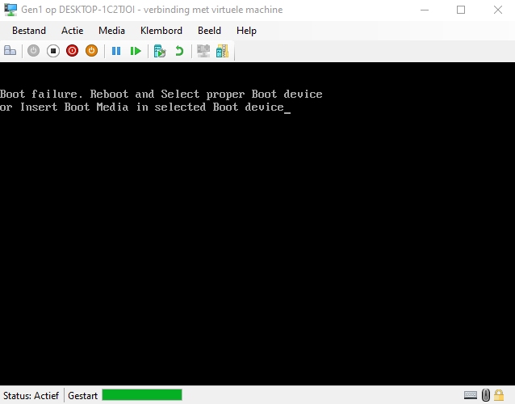

Hetzelfde probleem ziet er op een Gen2-VM heel anders uit:
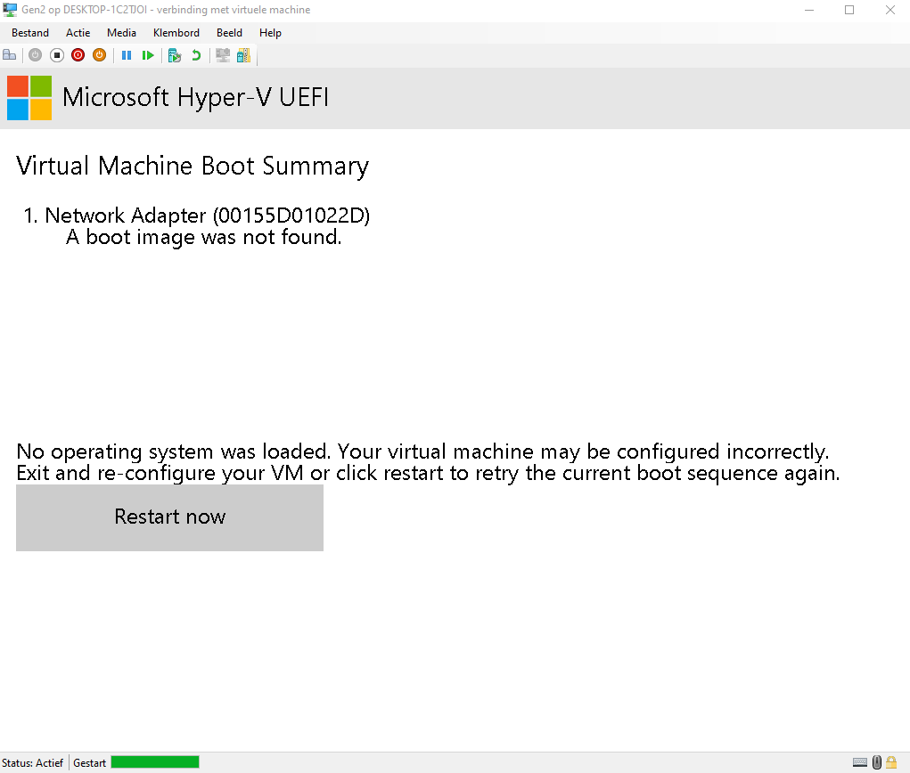

# Afsluiten vs Uitschakelen
Probeer tot slot beide VM's **af te sluiten**.

Je zal deze foutmelding krijgen:

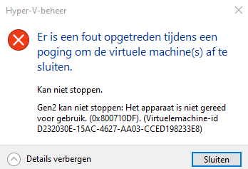

Er ziet dus niets anders op dan deze machines **uit te schakelen**.

Maar de integration service draait toch?

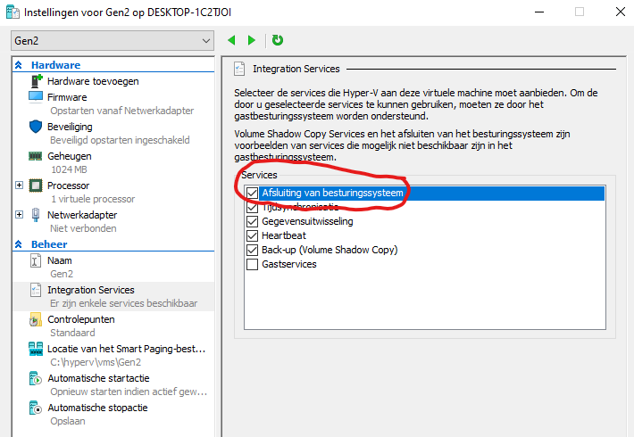

> Wanneer deze integratie-service is uitgeschakeld, krijgen we van Hyper-V deze foutmelding:

> 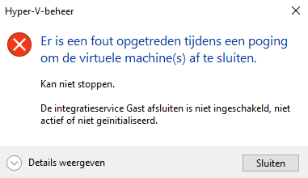

Waarom werkt dit dan niet?

Er draait op de VM's geen OS dat luistert naar het *afsluit-signaal* en er kan bijgevolg dus niet *netjes* worden afgesloten.

Net zoals bij een echte PC die vasthangt op een BIOS- of UEFI-startscherm, zit er niets anders op dat de PC uit te schakelen (soms door de power-knop langer ingedrukt te houden) of te herstarten (b.v. met `CRTL-ALT-DEL`: iets wat de meeste BIOS/UEFI's wel ondersteunen).

