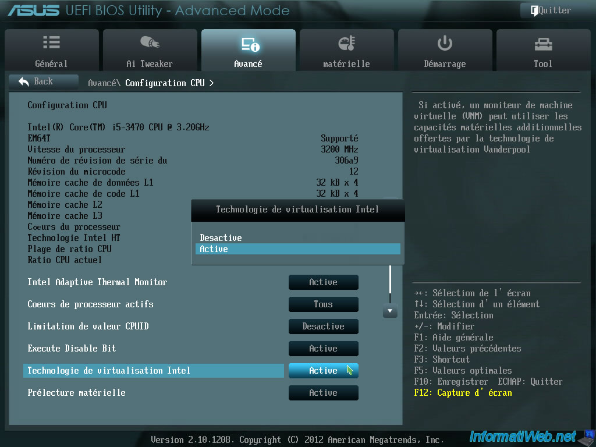
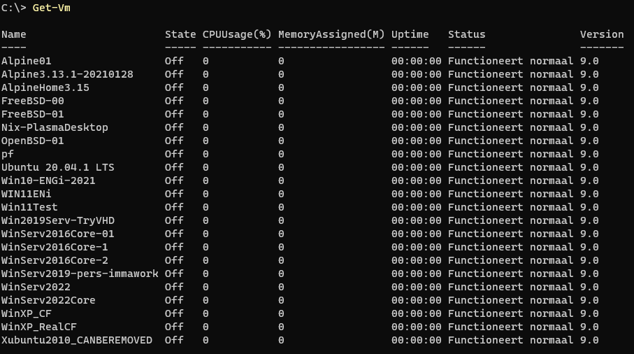

# Voorbereiding

Moderne CPU's ondersteunen virtualisatie maar dit is niet altijd standaard geactiveerd.

Bij Intel heet deze technologie **VT-x** terwijl AMD dit **AMD-V** noemt.

In je BIOS of UEFI moet je deze optie inschakelen voordat een Hypervisor zoals Hyper-V op de meest performante manier kan werken.

Als je een oude machine hebt waarvan de CPU geen virtualisatie ondersteunt, kan je soms toch nog virtuele machines draaien maar deze zullen dan véél trager werken. In dat geval zal je zelf research moeten doen naar andere virtualisatie-oplossingen zoals:

- https://www.virtualbox.org/
- https://www.qemu.org/
- ...

# Theorie

Normaal gezien heeft het OS de volledige controle over de hardware. In het geval van *trage* virtualisatie-software (die "overal" werkt) verandert hier niets aan.

Tegenwoordig (en zeker bij servers in datacenters!) willen (en kunnen) we VM's echter quasi even snel laten werken als het *host-OS*.

Het is dan wel nodig dat de hardware wordt beheerd door de **Hypervisor**. Het lijkt alsof het host-OS exact hetzelfde blijft werken maar in de afbeelding zien we hoe het host-OS (*root-OS*) de hardware nu ook **via de Hypervisor** (*level 0*) benadert, net zoals alle guest-OS's (de VM's).

Een Hypervisor installeren is dus best een ingrijpende handeling (hoewel dit op het eerste zicht bij gewoon gebruik niet opvalt). Hyper-V werkt dan ook enkel op **Windows Pro** (en niet op **Windows Home**).

# Hypervisor en tools installeren in Windows

Een Windows OS bevat optionele toepassingen die we kunnen installeren via het hulpprogramma `OptionalFeatures.exe`:

> Met het commando `Get-Command OptionalFeatures.exe` zien we dat dit inderdaad een programma is dat geïnstalleerd staat in de map van Windows zelf:
> 
> 

We installeren best alle 4 de onderdelen:

1. Het grafische beheerprogramma voor Hyper-V-servers

2. De Powershell-beheer-commando's voor Hyper-V-servers

3. De Hyper-V-server zelf (de **Hypervisor**)

> Deze optie is alleen beschikbaar in **Windows Pro**. Gelukkig kan je sinds Windows 10 een **Windows Home**-editie gemakkelijk omzetten naar een professionele versie door een correcte licentie-sleutel in te voeren! Zoek hiervoor zelf naar informatie indien nodig! De instelling (school of bedrijf) waartoe jij behoort, biedt misschien gratis (of goedkopere) licentie-sleutels aan dus informeer hier naar voor je zelf iets koopt!

4. Services waarmee de Hyper-V Hypervisor beter geïntegreerd wordt in het host-OS en waar de VM's hun voordeel uit kunnen halen.

Voor het installeren van de Hypervisor (3) en de services (4) is een herstart van de computer nodig. De **Hypervisor-laag** wordt nu immers verantwoordelijk voor het aansturen v.d. hardware (in het schema hierboven gevisualiseerd als *level 0*).

# Inhoud v.d. verschillende optional features

Elke optie installeert en configureert een aantal zaken. We overlopen deze even.

## 1. Het grafische beheerprogramma voor Hyper-V-servers

Het commando `virtmgmt.msc` is nu geïnstalleerd:

Net zoals vele andere Windows-tools (zoals de disk management console `diskmgmt.msc` of de device manager `devmgmt.msc`) is dit een typische management console die dus ook via `mmc.exe` kan worden benaderd.

Wanneer we `virtmgmt.msc` uitvoeren, zien we dit venster:

In bovenstaande afbeelding is een server (met de naam `DESKTOP-1C2TJOI`) aanwezig maar dit is enkel het geval als je deze zelf hebt toegevoegd of als er een Hypervisor op je lokale machine geïnstalleerd is (stap 3)!

Je kan in `virtmgmt.msc` dus ook verbinding maken met **meerdere** Hyper-V servers indien deze in je (lokale) netwerk aanwezig zijn!

Wanneer we verbinding maken met een Hyper-V server, kunnen we vanuit `virtmgmt.msc` deze server beheren.

Hier zie je b.v. de Hyper-V-server die draait op de machine `DESKTOP-1C2TJOI`. Je ziet trouwens een heleboel geïnstalleerde VM's staan (die momenteel allemaal uitgeschakeld zijn):

## 2. De Powershell-beheer-commando's voor Hyper-V-servers

Wanneer deze optie werd geïnstalleerd via `OptionalFeatures.exe`, zullen er een heleboel nieuwe Powershell-commando's beschikbaar zijn.

Je kan een overzicht opvragen hiervan met `Get-Command -Module Hyper-V`:

> *Met dit commando kan je zelfs zien dat er in dit geval 238 Powershell-commando's werden toegevoegd:
>
> *

Één van de basiscommando's is `Get-VM`, wat je dezelfde lijst met VM's geeft als die we in `virtmgmt.msc` zagen:

Powershell-commando's kunnen erg interessant zijn om scripts te schrijven die automatisch VM's aanmaken of configureren, disks toevoegen, ...

Hier is een voorbeeld hoe je van alle VM's de naam en de generatie kan opvragen (iets wat niet mogelijk is via `virtmgmt.msc`):

En hier zie je b.v. hoe we met `Get-VMHardDiskDrive` kunnen opvragen welke schijven gekoppeld zijn aan de VM met de naam `Win11ENi`:

Of als we b.v. willen focussen op enkel de paden en het type schijf-controller:

## 3. De Hyper-V-server zelf en 4. Services waarmee de Hyper-V Hypervisor beter geïntegreerd wordt in het host-OS 

De echte Hyper-V Hypervisor draait dus ergens in de dieptes van het OS, eigenlijk zelfs nog ONDER het OS. In het host-OS draaien er dan nog enkele hulp-services waarmee de hypervisor wordt beheerst.

Vanuit `services.msc` kunnen we een aantal v.d. Hyper-V-services waarnemen:

In `virtmgmt.msc` kunnen we de Hyper-V-service in zijn geheel starten of stoppen:

- via de zijbalk:

- via de menubalk (**als de server het huidige geselecteerde object is!**):

En vanuit de instellingen van **elke** VM, kunnen we ook bepaalde **integratie-services** in- of uitschakelen (je herkent dezelfde namen als eerder in `services.msc`):

Deze integratie-services zorgen dat de VM beter functioneert, b.v.
- we kunnen VM's nu netjes laten afsluiten
- de klok van het gast-OS wordt gesynchroniseerd met dat van het host-OS
- ...

# Conclusies

We zien dat Hyper-V een zeer professionale virtualisatie-oplossing is waarmee OS's in een VM even snel kunnen draaien als rechtstreeks op de hardware (*bare metal*). Je kan zeer veel VM's op 1 PC installeren. Je kan zelfs meerdere VM's gelijktijdig draaien als je maar genoeg processor-kracht en RAM-geheugen hebt.

Wat het beheren van Hyper-V-servers betreft, kan je scenario's bedenken waarbij in een bedrijfsnetwerk op verschillende fysieke PC's Hyper-V-servers draaien die allemaal vanuit 1 centrale Hyper-V-manangement-console kunnen beheerd worden.

Dankzij Powershell-commando's wordt het zelfs mogelijk om honderden of duizenden Hyper-V-servers gelijktijdig aan te sturen of saaie repetitieve taken te automatiseren.
