# Hyper-V-server-instellingen

Via de Hyper-V-management console kan je acties uitvoeren op een Hyper-V-**server**.

Daarvoor moet je eerst de server aanklikken:

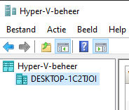

Je kan op 2 manieren acties uitvoeren op de geselecteerde server:

- Via het menu aan de zijkant:

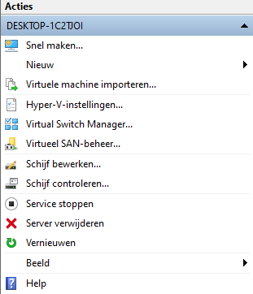

- Via je het `Actie`-menu bovenaan (maar dan moet de server echt geselecteerd zijn):

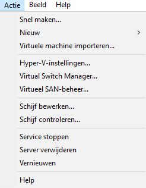

Je kan b.v. algemene instellingen voor deze Hyper-V-server veranderen, zoals met welke snelkoppeling je de controle van het toetsenbord weer aan het host-OS kan geven:

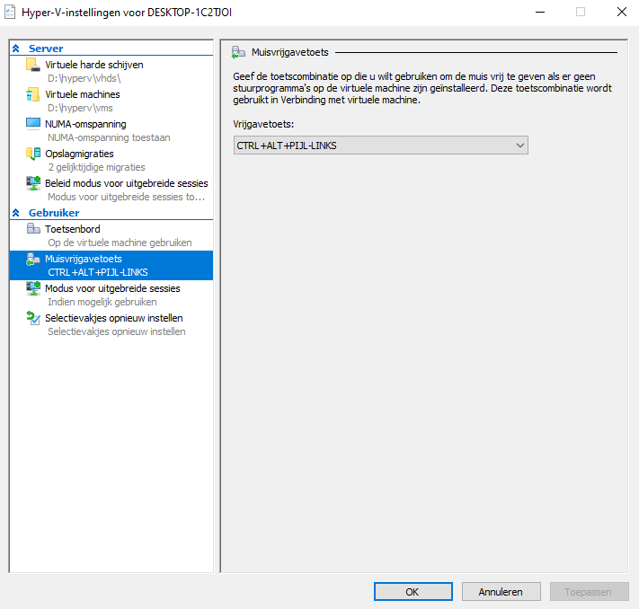

Met de **Virtual Switch Manager** kan je virtuele netwerkhardware toevoegen aan de Hyper-V-server. Dit maakt potentieel zeer complexe netwerk-setups mogelijk waarvoor je met echte hardware zeer veel toestellen en kabels nodig zou hebben:

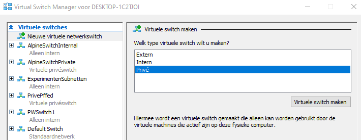

Een Hyper-V-server kan zelfs rechtstreeks een fysieke netwerkkaart van je host benutten. Dit gebeurt vaak in datacenters waar een fysieke server b.v. 3 netwerkkaarten heeft waarvan er dan b.v. 2 rechtstreeks door een VM kunnen worden overgenomen.

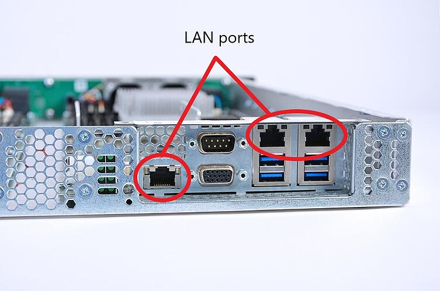

Met Hyper-V kunnen we dus niet alleen VM's virtueel aan elkaar koppelen maar kunnen we VM's ook rechtstreeks met de fysieke buitenwereld laten communiceren! (De Hypervisor-laag kan dus m.a.w. een fysieke netwerk-adapter rechtstreeks koppelen aan  1 specifieke VM. Het host-OS weet van deze netwerk-adapter dan zelfs het bestaan niet meer af! 

> De hypervisor beheert de hardware!

# per-VM-instellingen

Er zijn ook instellingen die we **per VM** kunnen doen.

Wanneer we een VM selecteren, toont het Acties-menu deze mogelijkheden:

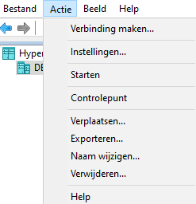

Ook via de zijbalk zijn dezelfde configuratie-mogelijkheden bereikbaar:

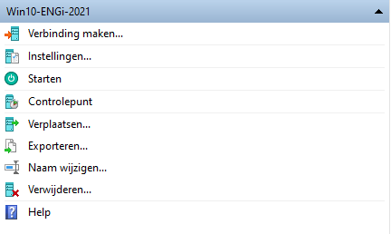

En ook door rechts te klikken op een VM, krijgen we dezelfde opties te zien:

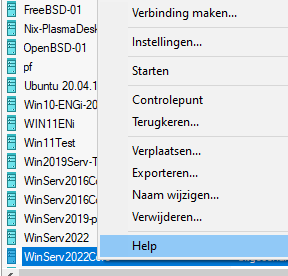

In de middenbalk, onder de lijst met VM's, zien we nog het subvenster voor **Controlepunten** of **snapshots**.

Hier zie je b.v. hoe deze VM een aantal automatisch gemaakte snapshots heeft:

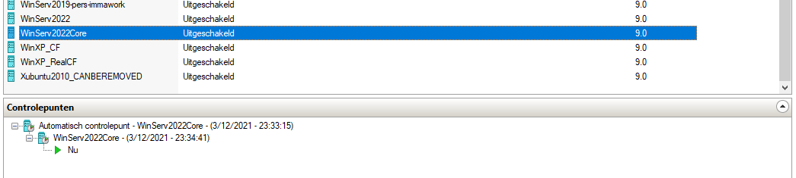

Met controlepunten kan je de bestanden op een schijf als het ware **bevriezen** zodat je er later naar kan terugkeren. 

Controlepunten zijn een **zeer krachtig** mechanisme
- **in labo-situaties**: om naar hartelust te kunnen experimenteren met de instellingen van OS's en altijd te kunnen terugkeren naar de beginsituatie
- **in producatie-omgevingen**: om een gecrashte server terug online te plaatsen vanuit een eerdere werkende versie
- ...

Het belangrijkste venster om VM's te configureren, bereik je via **Instellingen...**.
Hier zie je b.v. hoeveel CPU-cores aan deze VM zijn toegewezen:

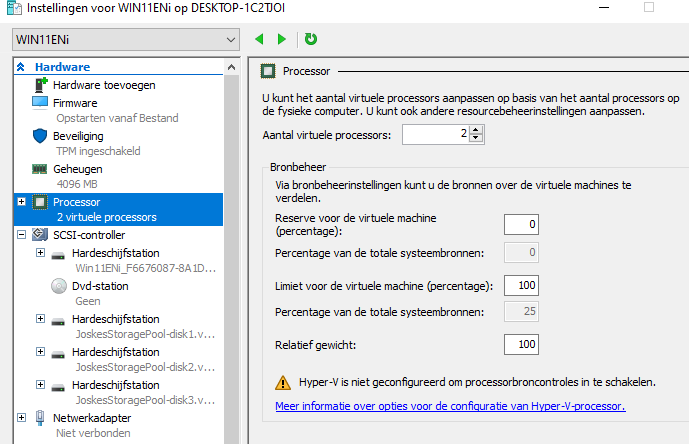

> De VM in dit screenshot werd gebruikt om Windows 11 te testen toen het nog heel nieuw was. Het viel op dat Windows 11 minstens 2 CPU-cores verwacht en ook niet meer werkt op een ouderwets BIOS. Zelfs op een modern UEFI moesten in Hyper-V nog speciale *Secure Boot*-instellingen gedaan worden om Windows 11 te laten werken.
> Dit alles toont meteen een nuttige use-case aan van Hyper-V: **het uitproberen van gloednieuwe OS-versies**!

# Conclusie

De grafische Hyper-V-management-console biedt heel wat mogelijkheden om een Hyper-V-server te beheren:

- Meerdere VM's die kunnen in- en uitgeschakeld worden en waarvan de virtuele hardware met enkele muiskliks kan aangepast worden (b.v. CPU-cores, RAM-geheugen, schijf-controllers, ...)
- Controlepunten waarmee je als het ware kan terugkeren in de tijd
- VM's maken die kunnen geëxporteerd of gemigreerd worden naar andere fysieke machines, die kunnen gebackupt worden of kunnen worden doorgegeven aan andere mensen
- Virtuele switches zijn een manier om de VM's onderling te laten communiceren maar er is ook de mogelijkheid om samen met fysieke netwerkadapters een hybride netwerk te bouwen bestaande uit zowel virtuele als fysieke netwerk-apparaten.
- ...
