# Welke distro?

Linux-distributies komen (en gaan) in enorm veel variëteiten. Kijk b.v. op https://distrowatch.com/. Welke moeten we kiezen?

Voor beginners wordt vaak Ubuntu aangeraden, dus je zou je naar https://ubuntu.com/ kunnen reppen en daar het benodigde bestand downloaden.

# Xubuntu downloaden

Als we wat krap zitten wat betreft onze hardware (RAM-geheugen, schijfruimte, ...), is het beter om een Linux-distributie te downloaden die afgestemt is op wat oudere hardware! https://xubuntu.org/ is zo'n distributie die hoewel *lightweight* toch alles aan boord heeft om als *daily driver* te fungeren.

Bij het downloaden heb je meestal de keuze tussen de allernieuwste versie of een **LTS** (Long-Term-Support)-versie. Omdat wij slechts even snel willen testen, kunnen we gerust de gloednieuwste versie downloaden. Voor een productie-server zou het beter zijn om een versie te kiezen die langer zal worden voorzien van nieuwe (beveiligings)updates.

Typisch aan Linux-distributies is dat ze op vele file-servers rondom de wereld (**mirrors**) beschikbaar zijn en bijna altijd vinden we (als we doorklikken) een hoop bestanden zoals dit:

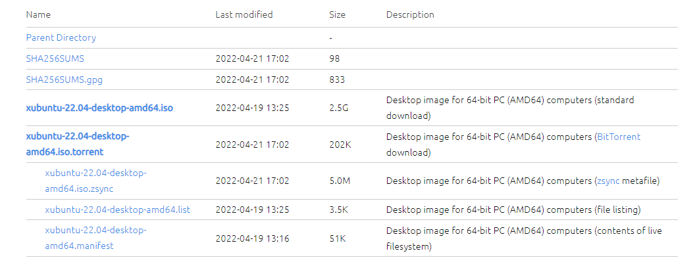

Uit de grootte van de bestanden, kan je al afleiden dat we het `.iso`-bestand moeten hebben, dit moeten we dus al zeker downloaden!

> In plaats van rechtstreeks van een server te downloaden, zouden we ook een `.torrent`-file kunnen downloaden om de nodige bestanden **peer 2 peer** te downloaden. We gaan dit nu niet doen.

Maar wat zijn de bestanden `SHA256SUMS` en `SHA256SUMS.gpg`?

Hiermee kunnen we controleren of onze download goed gelukt is. De `.gpg`-versie gebruikt zelfs nog extra sleutels waarmee we zouden kunnen controleren of de `.iso` die we downloaden niet door een kwaadwillende hacker is samengesteld. Wij zullen ons echter beperken tot een iets minder stricte controle...

# Het juiste ISO-bestand downloaden

> *Wacht eens even! Welk bestand moet ik downloaden? In jouw voorbeeld is het makkelijk, want er is maar 1 iso-bestand. Maar ik heb b.v. Alpine Linux (https://alpinelinux.org/downloads/) willen downloaden en nu moet ik hieruit kiezen! Wat is dit allemaal?*

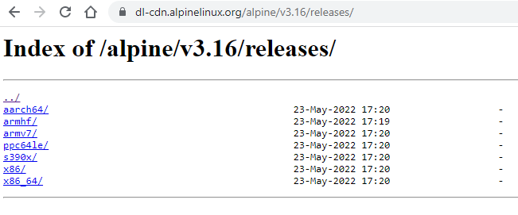

De meeste Linux-distributies zijn beschikbaar voor verschillende **CPU-architecturen**. Je kan het b.v. draaien op een traditionele **Intel/AMD 64-bit** PC, een oudere** Intel/AMD 32-bit** PC, een **32-bit ARM**-processor zoals van een Raspberry PI 3 of een Apple M1 **64-bit ARM**-processor of misschien zelfs een **RISC-V**-development board voor embedded toepassingen.

Kijk dus altijd goed uit dat je de juiste versie voor jouw hardware download!

Omdat VM's het snelste werken als je dezelfde architectuur gebruikt als het host-OS (en in het geval van Hyper-V is dat momenteel zelfs de enige mogelijkheid), kies je best dezelfde architectuur als de hardware van de host. Dit wil dus zeggen een **64-bit Intel/AMD architectuur**, vaak afgekort als `x86_64` of `amd64`. Je kan soms kiezen voor een oudere 32-bit Intel/AMD-architectuur (vaak `x86`). Dit werkt soms maar niet altijd.

# Downloads verifiëren

> *Ok, ik heb een ISO-bestand gedownload voor mijn CPU-architectuur. Wat nu?*

> We gaan onze PC even laten narekenen of het bestand goed gedownload is.

> *Maar ik dacht dat we zo snel mogelijk een Linux-machine gingen opstarten en nu moeten we eerst dit `.iso`-bestand controleren? Is dit echt nodig? Ik vertrouw wel dat het goed gedownload is en als het niet werkt, zal ik de VM later wel zien crashen!*

> Voor een snelle test is dit inderdaad een overbodige stap maar we vonden dit het ideale moment om je even te wijzen op het bestaan van een geweldige ontdekking, misschien zelfs de ontdekking van de (vorige) eeuw, nl. **hashes**, **hashcodes**, **hashsums** of hoe je ze ook wil noemen! Cryptografie is eigenlijk echt iets wonderbaarlijks en misschien zelfs een hoeksteen v.d. moderne technologische samenleving!

> *Zucht, ok dan...*

Op de download-server zien we in het tekstbestand `SHA256SUMS` deze inhoud:

```
61a6e4df2f89782541e114cbb23dcde7ed8851ac0b013e952d2afd0094646c46 *xubuntu-22.04-desktop-amd64.iso
```

Rechts staat de naam van het bestand dat we net gedownload hebben. Links staat een code bestaande uit hexadecimale cijfers. Als we deze code zelf opnieuw kunnen genereren, wil dit zeggen dat we het bestand byte-voor-byte correct hebben gedownload! Dit kunnen we b.v. doen met het Powershell-commando `Get-FileHash`.

# Maar eerst: file management

Een ordelijke werkmappen-structuur is de basis voor alle complexe labo-situaties die we in de toekomst willen doen, dus laten we als volgt voorbereiden.

> De voorbeelden maken gebruik van een Powershell-terminal maar je kan natuurlijk even goed in Verkenner werken!

Maak op je schijf een map voor alle Hyper-V bestanden. Ik gebruik als voorbeeld `C:\HyperV` en maak hierin 3 submappen:
- `vhds`
- `vms`
- `isos`

> TIP: `iso`'s en `vhd`'s zijn vaak meerdere GiB's groot. Kies dus liefst een (externe) schijf of partitie waar je **voldoende schijfruimte** hebt! Let wel: gebruik **geen** gedeelde mappen (OneDrive, GDrive, ...) omdat dit je files kan corrumperen als ze vanaf het netwerk worden geüpdated! Hyper-V is een *systeem*-tool en de bestanden die je gebruikt, horen op **een echte fysieke schijf** te staan zonder verdere franjes zoals automatische syncs met cloud-drives e.d.!

In je Powershell-venster, kan je ongeveer dit doen:
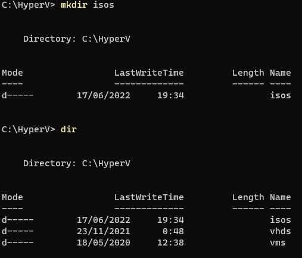

In de instellingen van je Hyper-V-server, ga je deze nieuw gemaakte mappen instellen:
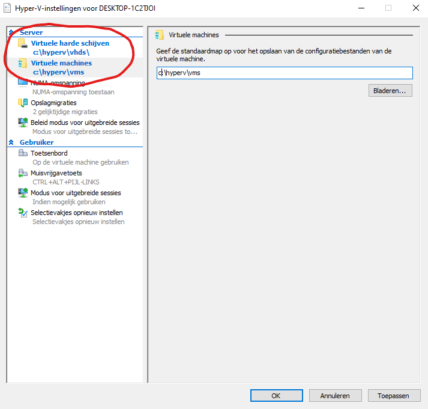

Vanaf nu zal Hyper-V standaard steeds deze locaties gebruiken voor je nieuwe VM- en VHD-bestanden. Handig! Dit gaat je veel klik- en zoekwerk besparen! (Een investering in de toekomst dus!)

## Het ISO-bestand

Verplaats het gedownloade ISO-bestand (b.v. `xubuntu-22.04-desktop-amd64.iso`)naar de map `C:\HyperV\isos` .

We zien dat het bestand waarschijnlijk wel de juiste grootte heeft:
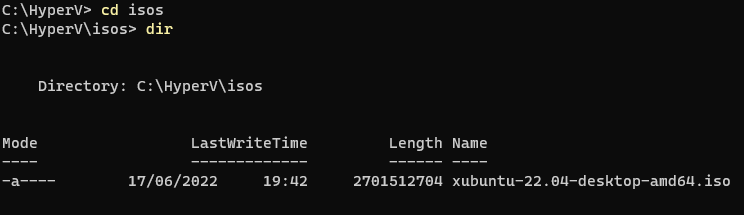

Maar om echt zeker te zijn, kunnen we beter `Get-FileHash` gebruiken. Dit zal het bestand byte-voor-byte-controleren en een `SHA256`-hashcode genereren.

Gebruik dit volledige commando:

```
 Get-FileHash -Algorithm SHA256 -Path .\xubuntu-22.04-desktop-amd64.iso
 ```

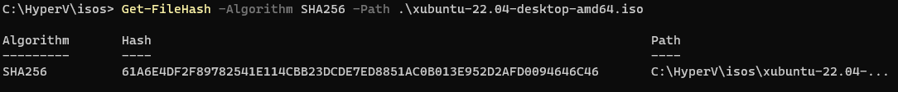

Of een verkorte versie (omdat `SHA256` toch het default-hash-algoritme is dat `Get-FileHash` gebruikt):

```
Get-FileHash xubuntu-22.04-desktop-amd64.iso
```

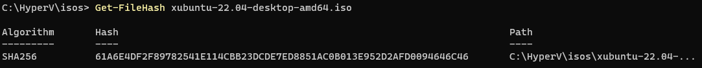

En hoera! De **hashsum** (*hash-som*) is identiek aan die van de server. Transfer succesfully completed!

# Ready? Set!

Tijd voor een nieuwe VM!

Als een echte *noob*, gebruiken we een goede oude *Wizard*. Maar (wannabe-)pro's als we zijn, gaan we deze niet al te veel laten doen en later zelf nog wat na-configureren. Laten we eens kijken hoe ver we geraken...

1. Start de *nieuwe VM-wizard*

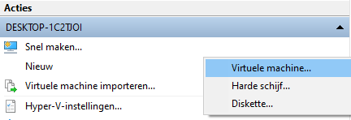

2. Volgende!

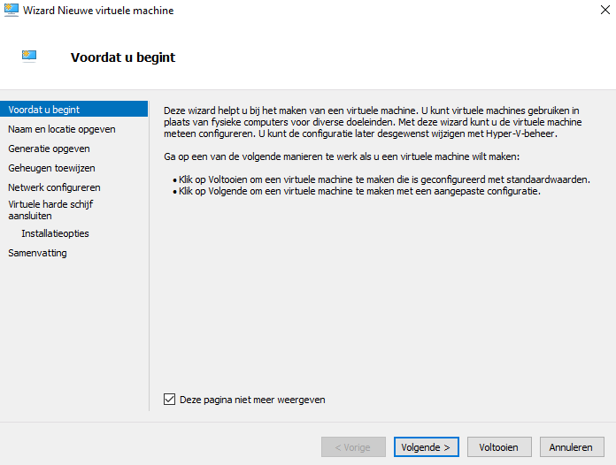

> Vink je *Deze pagina niet meer weergeven* aan?

3. Geef een naam aan de VM.

Kort en krachtig: de naam van de Linux-distributie maar meteen ook het versienummer erbij zodat we in de toekomst in één oogopslag zien of we nog up-to-date zijn: `Xubuntu2204`. Wist je trouwens dat (X)ubuntu voor de versienummers het jaartal en de maand gebruikt? Dit is dus de versie van **april 2022**!

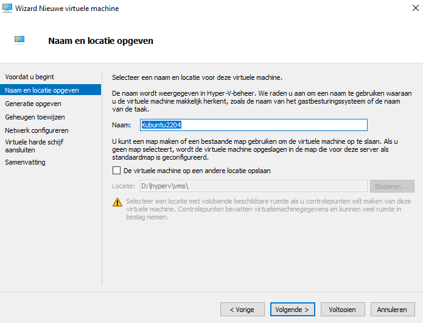

> Vink je *De virtuele machine op een andere locatie opslaan* aan? (Niet nodig als je eerder de standaard-paden al goed hebt gezet!)

4. Generation 0 or 1? **BIOS** of **UEFI**? *Old-school* or *Shiny-new-thing*?

We hebben een `.iso` gedownload van een Linux-distro die bedoeld is om ook goed te werken op oudere hardware, dus wat denk je?

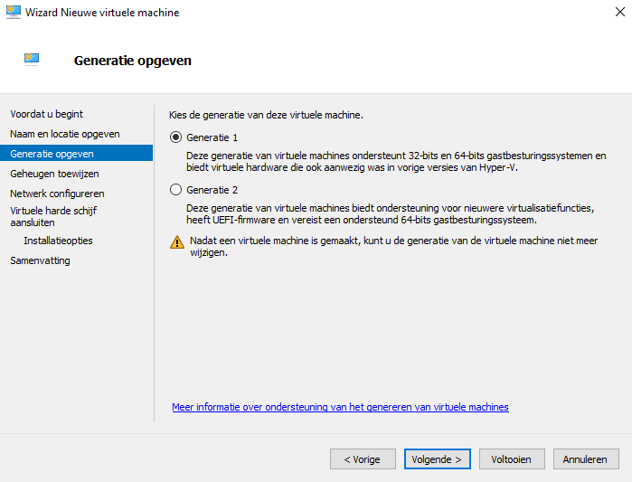

5. Hoeveel RAM-geheugen?

Bijna altijd kies je voor **Dynamisch geheugen**. Laat Hyper-V zelf maar het RAM-gebruik managen. It probably knows best! Het getal dat je invult maakt dan weinig uit.

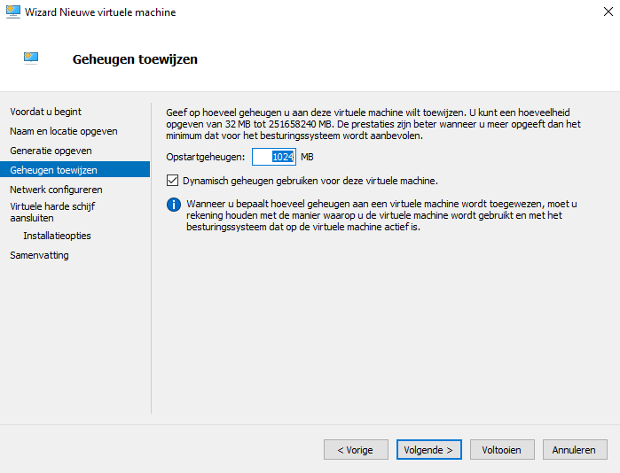

6. Netwerk?

Virtuele netwerk-adapters en -switches in Hyper-V verdienen een hele uitleg op zichzelf dus dat is voor later. Gelukkig kan je dit steeds veranderen (lang leve virtualisatie)! Dus geen nood en kies nu gerust **Niet verbonden**! 

Moest je toch twijfelen, oordeel dan even zelf:

- **Niet verbonden**: je zal geen Internet hebben en je zal dus enkel gebruik kunnen maken van de bestanden op de `iso`-file. Als je een **full installer** gedownload hebt die geen verdere bestanden moet downloaden, is dit ok en de meest eenvoudige optie voor een eerste *test-run*!
- **Default Switch**: een klein wondertje van een virtuele switch (eigenlijk een virtueel **NAT-routertje** met een **DHCP-server** erg gelijkaardig aan het routertje dat bij jou thuis in de garage of de woonkamer hangt maar dan virtueel). Kies dit als je graag Internet hebt op de VM. Als je een **minimal installation ISO** gedownload hebt (die nog installatie-bestanden van Internet moet downloaden), heb je dit nodig. 

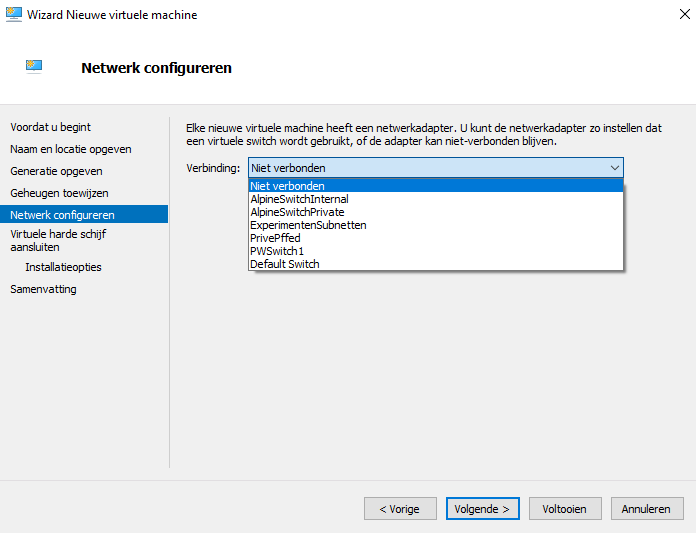

7. Disks / storage

Omgaan met disks (`.vhd`-, `.vhdx`-,  `.avhdx`-bestanden) is voor een volgende keer. We kiezen hier voor **Later een virtuele disk koppelen**!

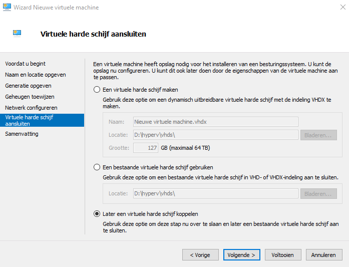

8. Looking good! Finish!

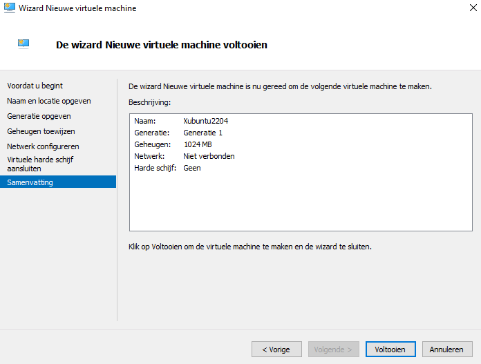


# ...Go!?

Wacht even! Wat heeft die goede oude *Wizard* eigenlijk allemaal gedaan? Even double-checken (en kijken hoe het zit met onze **mappenstructuur**)!

Kijk eerst eens naar de **Instellingen** van onze nieuwe VM:

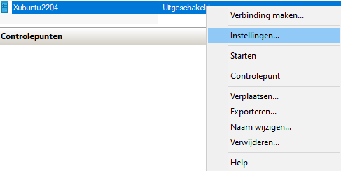

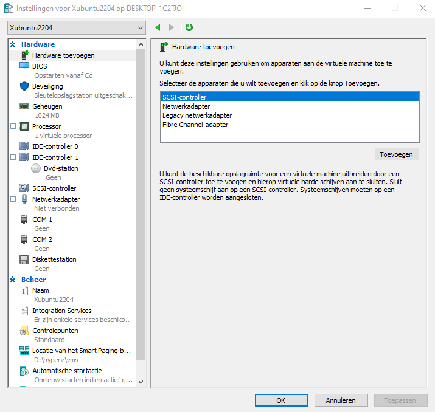

Hier zie je met wat voor (virtuele) hardware we te maken hebben.

Wat we zoal zien als we door de instellingen *browsen*:

- 1 CPU-core
- 1024 Mb RAM-geheugen (maar *dynamisch* beheerd door Hyper-V)
- een BIOS
- geen netwerkadapter
- gen diskette-station maar geen floppy die er in zit (ja die oude dingen ook bekend als *3D-geprinte save-iconen* ;-))
- Een dvd-station maar geen cd of dvd die er in zit

En wat zijn die `COM1` en `COM2`?

Eigenlijk heb je nu zo'n beetje een PC uit de jaren 90 met erg ouderwetse *seriële poorten* (nummer 7 op de afbeelding). Ooit werden muizen hierop aangesloten of soms, als je een elektronica-nerd was, kon je dit gebruiken om eigen gemaakte hardware-bordjes of andere gekke dingen aan de PC aan te sluiten. 

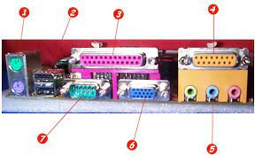

You know, *jaren '90-stuff*. Net zoals die floppy's.


> *Hey, the 80s called and they want their datasette back! Straks begin je nog over de Commodore 64! Kunnen we verder naar nu, de toekomst and beyond?*

Maar lees dit toch nog maar even aandachtig. Weet je nog dat we hier eerder ergens zeiden dat Hyper-V installeren een vrij ingrijpende actie is?

Wel, om toekomstige problemen te vermijden zoals daar zijn: je afvragen waarom je PC plots veel trager geworden is, doe het volgende:

Zet de **automatische start-actie** op **Niets**:
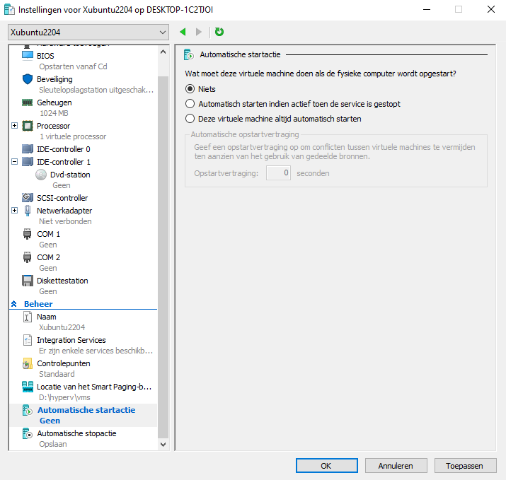

Dit vermijdt dat deze VM automatisch wordt opgestart bij de volgende reboot van je host-PC als je (per ongeluk) vergeten bent de VM eerst uit te schakelen.

En nu we hier toch zijn, zet ook de **automatische stop-actie** maar op **Het gastbesturingssysteem afsluiten**.

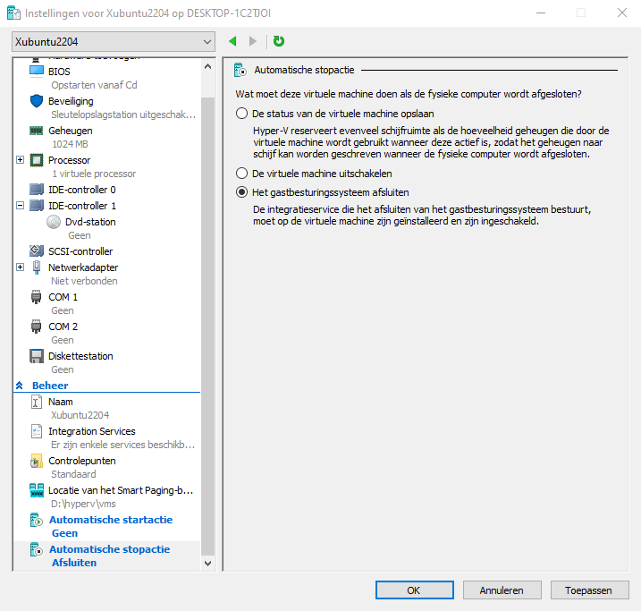

> ***Afsluiten**? Waarom niet **uitschakelen**? Abschalten! Schluss! 

Als je je VM graag **ganz kaputt** wil hebben, mag je ook **uitschakelen** kiezen. 

De 2 mogelijkheden (afsluiten vs. uitschakelen) kom je ook tegen wanneer je rechts-klikt op een draaiende machine, zoals je hier ziet:

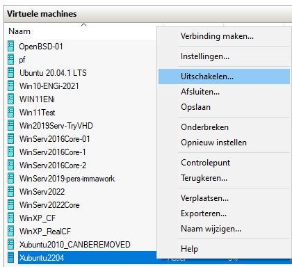

**Uitschakelen** wil zeggen: **de stekker er uit trekken**, de stroomtoevoer stoppen. Dit is meestal niet hoe je je PC wilt uitschakelen. Hoewel het soms niet veel uitmaakt. Het zijn vooral schijven die er gevoelig voor zijn. Stel dat een schijf net bezig is om iets weg te schrijven en dit wordt onderbroken: bestand **ganz kaputt**. Hoewel: dit valt tegenwoordig ook wel weer mee want hard disks hebben soms zelfs een ingebouwd mechanisme om met hun laatste rest-energie toch nog te redden wat er te redden valt.

**Afsluiten** wil zeggen dat het OS zijn best zal doen om alles netjes af te sluiten: alle rand-apparaten uitschakelen, alle open bestanden sluiten, ... Je weet wel: tijdens dat afsluit-geluidje dat ook Windows soms maakt.

Weet je trouwens nog dat we het hadden over de **integration services** die Hyper-V mee geïnstalleerd heeft op je PC (toen we daar in het begin aan het installeren waren met `OptionalFeatures.exe`)? Wel, één van die services kan bij het **afsluiten** van VM's van pas komen.

Hier zie je dat de **Afsluiting van besturingssysteem**-integration-service actief is:
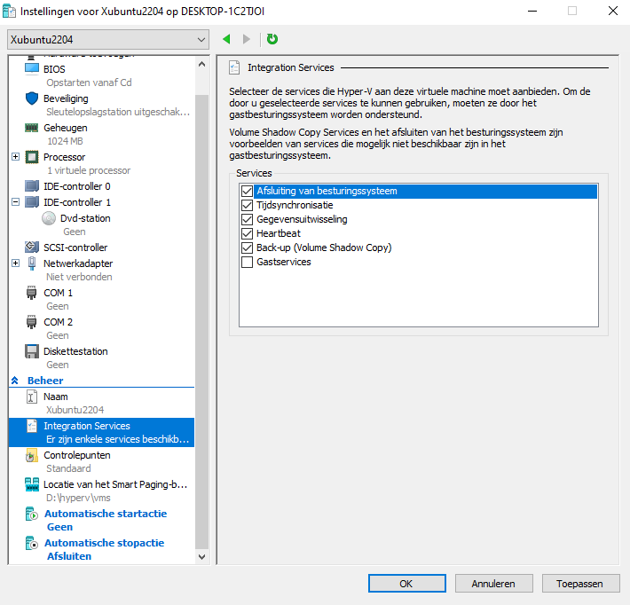

Als je in `virtmgmt.msc` het **Afsluiten**-commando aan een VM geeft, zal het deze actie doorsturen naar het gast-VM. Het hangt dan van het draaiende OS in de VM af of het daar iets mee doet. In het beste geval, sluit het gast-OS inderdaad netjes af (al dan niet met bijhorend afsluit-geluidje - tenminste als je virtuele audio-hardware werkt).

Kortom, is alles echt *ganz kaputt* als je **uitschakelen** kiest? Bah nee, niet echt. Als je enkel gebruik maakt van een *read-only* `ISO`-bestand, maakt het eigenlijk niet veel uit of je uitschakelt of (netjes) afsluit. En bovendien is het **virtuele** hardware!

# ...Go?! (part 2)
Kunnen we onderhand eindelijk de VM opstarten?

Bijna! Zet nog even **Automatische controlepunten gebruiken** af! De (wannabe-)IT-pro's als we zijn, kiezen we liever *zelf* wanneer we onze controlepunten maken. Dat scheelt ook weer wat tijd in het opstarten van de VM.

Kies dus deze instellingen voor de *snaphots*:

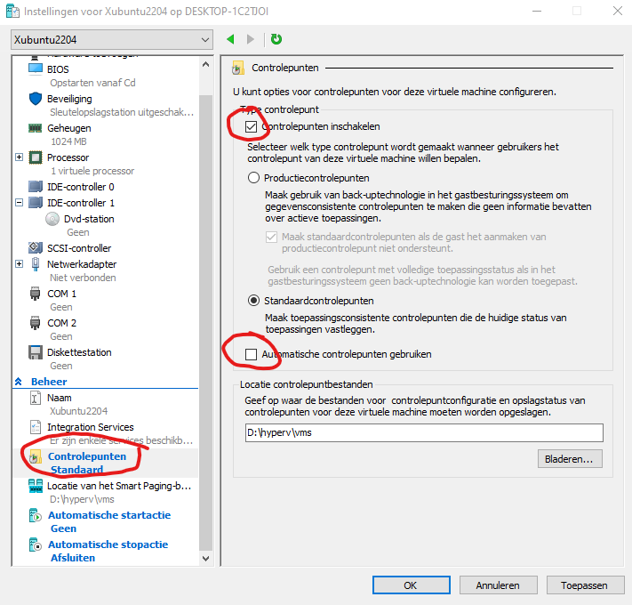

- Wel controlepunten ...
- ... maar geen **automatische** controlepunten
- en we zijn geen servers aan het configureren die in productie moeten draaien, dus **standaardcontrolepunten** zullen wel volstaan.

Oei, wat als ik de VM al had opgestart en er toch al een automatisch controlepunt is gemaakt?

Geen zorgen! Uiteraard kunnen we ook **controlepunten beheren** (hernoemen, verwijderen, ...) dus weggooien die rommel! Zoals hier te zien bij een andere VM:

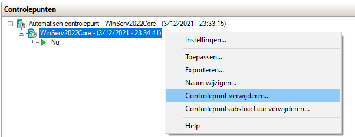

Wat er eigenlijk gebeurt als je controlepunten maakt, is dat er nieuwe `.vhd`-, `.vhdx`- of `.avhdx`-bestanden worden gemaakt in je `c:\hyperv\vhds`-map.

Momenteel hebben we nog geen VHD's gemaakt of gekoppeld, dus ons mapje is normaal gezien nog leeg:

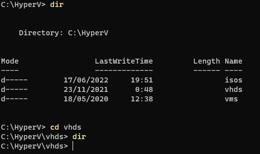

We hebben nu echter al wel een VM gemaakt (en net al die moeite gedaan om al die saaie instellingen goed te zetten) dus die moeten ergens bewaard zijn, toch?

Inderdaad, er zijn enkele mappen en bestanden gemaakt zoals een `.vmcx`, `.vmgs` en `.VMRS`-bestand:

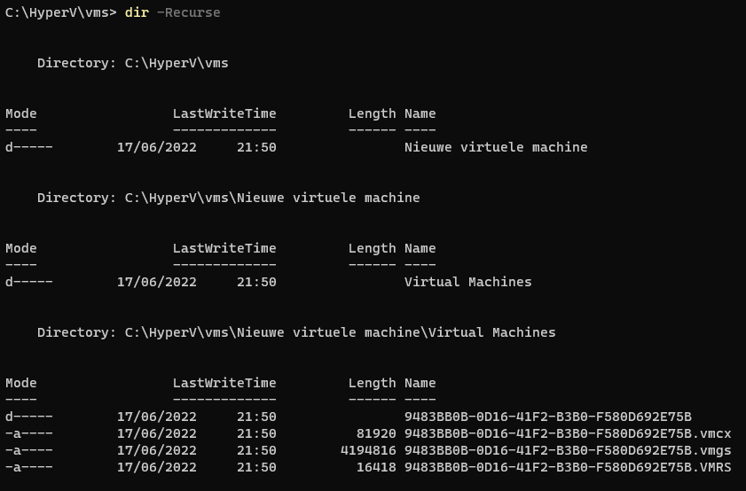

Het zijn allemaal nogal kleine bestandjes. Net groot genoeg om die instellingen in te bewaren.

> *Hé wacht even, waarom heet de map in dit screenshot `Nieuwe virtuele machine`*

> Ok. Busted. Tijdens het maken van deze screenshots had ik in die *goede oude Wizard* vergeten de juiste naam (`Xubuntu2204`) te kiezen. Die wizard heeft deze map gemaakt.

> *Maar in je `virtmgmt.msc` staat toch `Xubuntu2204`?*

> Klopt! Maar dat komt omdat ik vals gespeeld heb en achteraf de naam veranderd heb. 
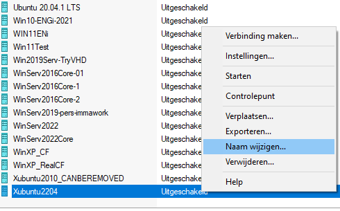

> *Niet erg netjes! Wat nu?*

> De VM weer verwijderen en opnieuw beginnen? Eventueel al die `.vmcx`, `.vmgs` en `.VMRS`-bestanden er in kopiëren en hernoemen enzo?

> *Of even verder snuffelen in de instellingen, misschien kan je dit nog veranderen? Hier misschien?*

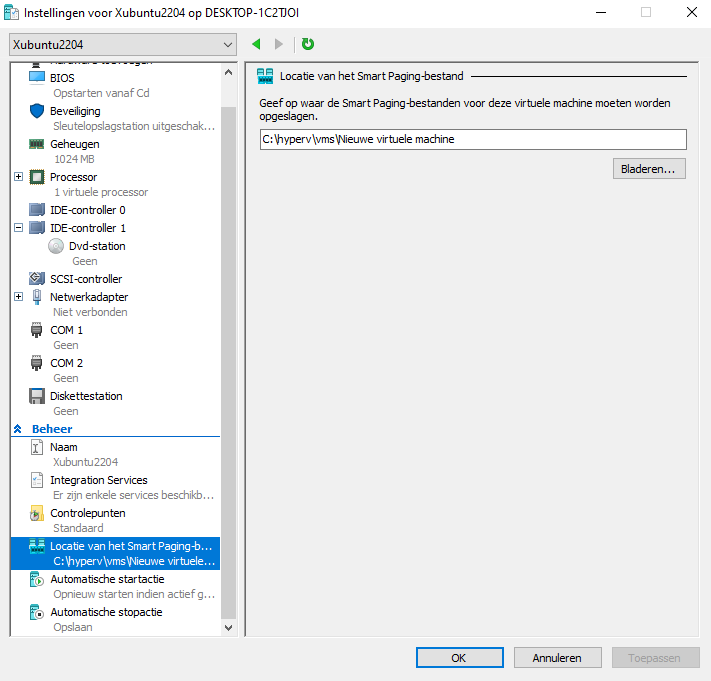

> Hmm... valt inderdaad te proberen: even het pad manueel aanpassen en op Toepassen of OK klikken...

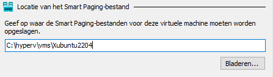

Eens kijken hoe de bestanden er nu uitzien in onze mappenstructuur (controlefreaks die we zijn):

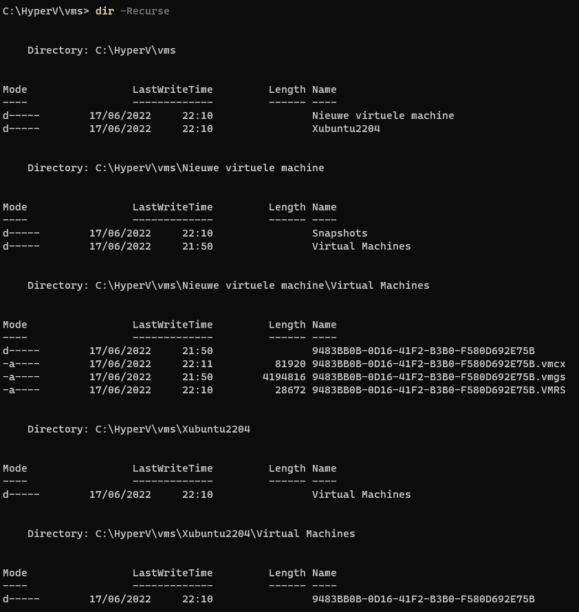

> Hmmm... We hebben nu wel een nieuwe map met een nieuwe random getal (Eigenlijk een UUID of GUID, probeer ook het commando `New-GUID` eens voor de lol dat telkens een nieuw random hexadecimaal getal zal genereren).

> *Hé, ja!*

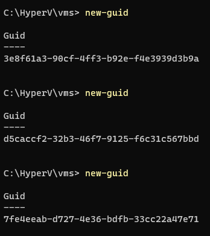

> Yep... Een hexadecimaal getal bestaande uit 32 hexadecimale cijfers, dat zijn maar liefst `16^32` of ...

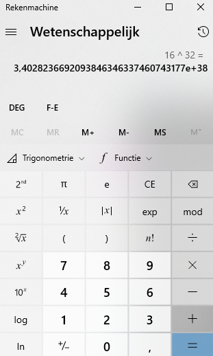

... zeer veel mogelijkheden ... zóveel dat de kans dat je 2 keer hetzelfde getal krijgt eigenlijk onbestaande is. De kans dat iemand op deze **wereld** (**GUID** = **Globally** Unique ID) of zelfs in dit **universum** (**UUID** = **Universally** Unique ID) dit getal nog eens genereert is *zo goed als* onbestaande.

> *Dus elke keer als je met de Wizard een nieuwe VM maakt, wordt een map gemaakt waarvan de naam een getal bevat dat zo groot is dat het in gans het universum (of toch minstens gans de wereld of onze melkweg) nooit meer zal bestaan*

> Elke keer als je `New-GUID` typet.

> ...


Maar nu heeft onze VM nog niet de juiste naam! Of 't is te zeggen: die kleine bestandjes (`.vmcx`, `.vmgs`, `.VMRS`) staan nog altijd in een submap van `Nieuwe virtuele machine`.

> *Hé, kijk! Bij **Controlepunten** kunnen we ook nog een pad aanpassen!*

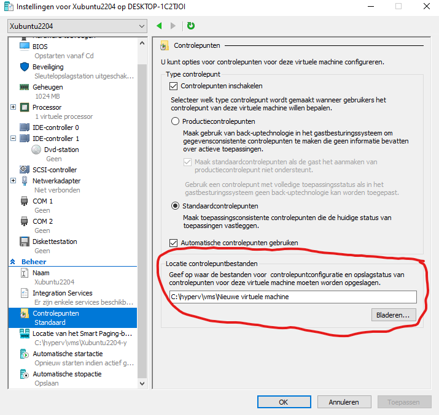

> Let's try!

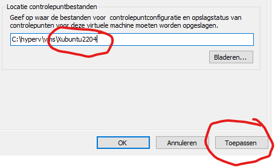

Helaas nog steeds staan de kleine bestandjes op de verkeerde plaats.

Wat als we nu de bestandjes gewoon zelf verplaatsen met Verkenner?

- aanvankelijk werkt dat niet omdat Hyper-V de bestanden **gelockt** heeft
- we kunnen wel de Hyper-V-service stoppen en de bestanden dan kopiëren
- maar dan zien we dat nadien de VM `Xubuntu2204` gewoon verdwenen is

Dan zouden we nog dit kunnen doen:

- Kiezen voor het importeren van een virtuele machine
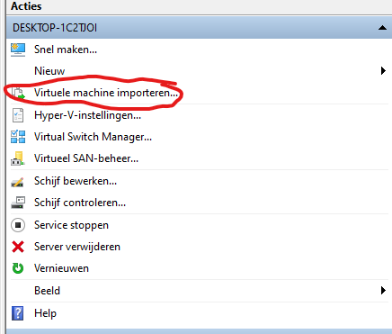
- De locatie van de juiste map kiezen (waar we ook al die kleine bestandjes net zelf in gekopieerd hebben)
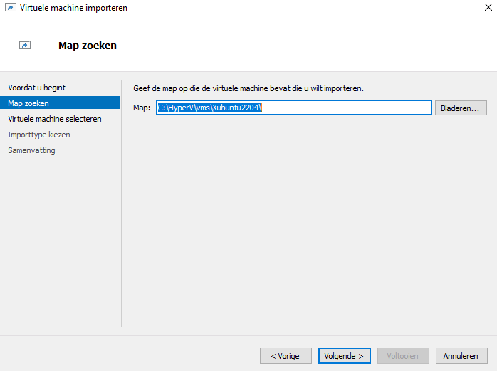
- In deze map heeft de import-wizard bestaande VM's gevonden
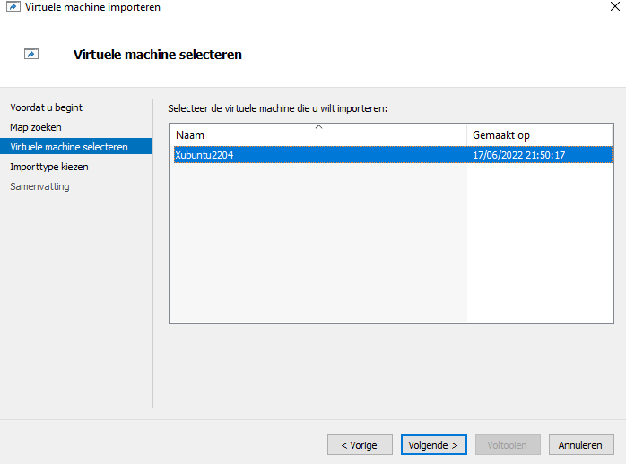
- En in 1 v.d. stappen v.d. wizard krijgen we dan zelfs de vraag of we een nieuw ID willen aanmaken of het bestaande gebruiken.
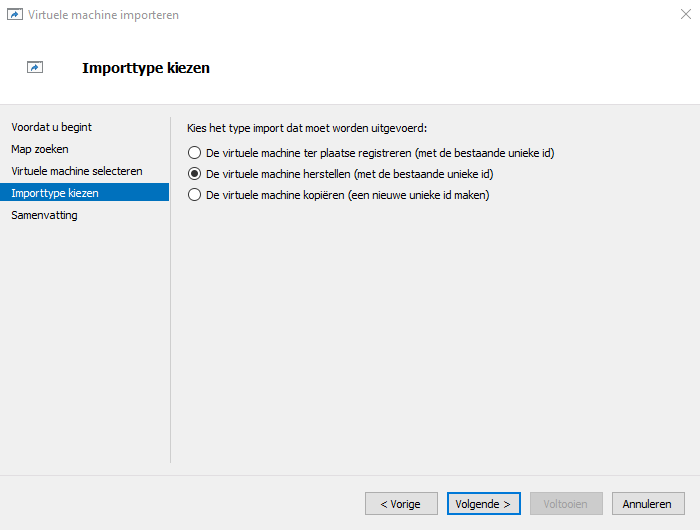

> *Gingen we niet gewoon snel een VM opstarten? Moeten we nu echt die hele import-wizard gaan uittesten omdat de naam niet goed is?*

> We zijn het ons inderdaad misschien een beetje moeilijk aan het maken. Laten we maar gewoon opnieuw die VM maken en snel de instellingen opnieuw doen! De hoofdzaak is nu dat we toch minstens *proberen* om onze mappenstructuur wat ordelijk te houden.

Alles verwijderen dus: zowel in `virtmgmt.msc` als op schijf, zodat we uiteindelijk weer een nette beginsituatie hebben:

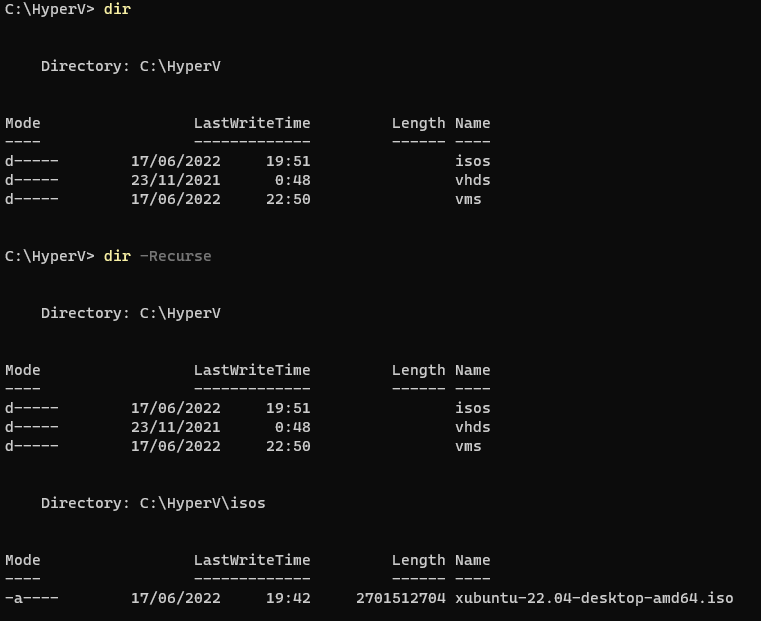

> Het ISO-bestand staat er gelukkig nog steeds!

Dus weer opnieuw de hele procedure:

- Nieuwe VM **met meteen de juiste naam!** (`Xubuntu2204`)
- Generatie 1 (met floppies en COM-poorten en andere rommel die we nooit nodig zullen hebben, maar het zij zo)
- Met dynamisch RAM-geheugen
- Zonder netwerk
- En zonder schijf!

# ... Go!!!
Inderdaad, lang genoeg getreuzeld. Laten we die VM in gang trappen!

Kiezen voor **Verbinding maken** of dubbelklikken zou het moeten doen:

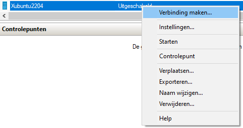

We hebben nu toch al een venster (een *verbinding*) met onze VM en we kunnen ook op *Starten* klikken!

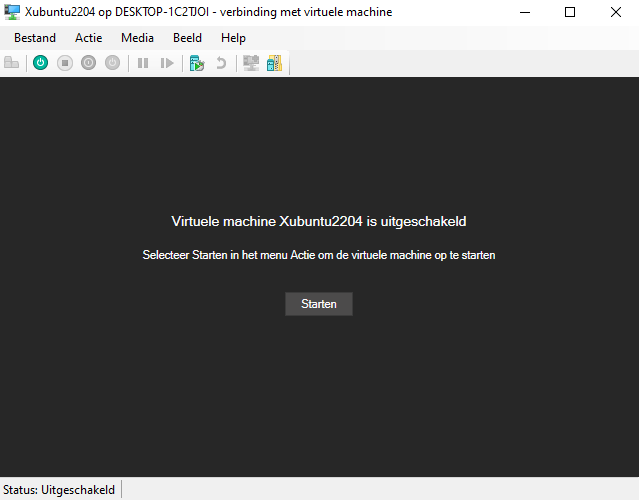

Let's go! And ....

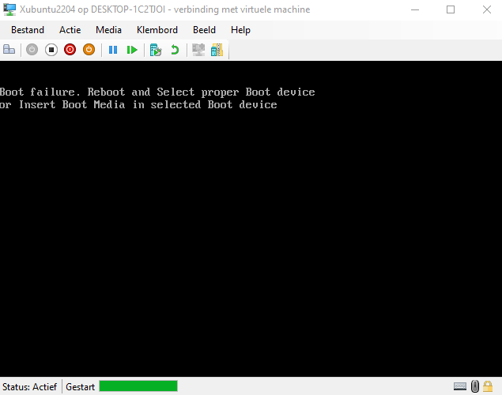

Wat? *Boot failure*?

Zelfs enkele malen op een keyboard-toets drukken, werkt niet. Steeds opnieuw *boot failure*:

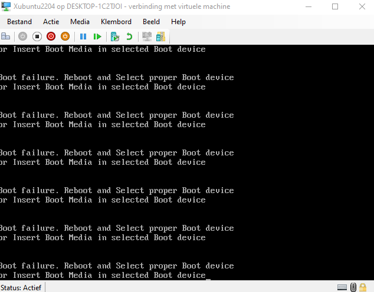

En nu zit ons toetsenbord zelfs vast in de VM!

(Gelukkig werkt ergens ander klikken of de toetsencombinatie `CTRL-ALT-LINKS` zoals we die eerder tegenkwamen in de Hyper-V-instsellingen.)

Maar wat nu?

# Boot disks

Zeg nooit zomaar **boot** disk tegen een gewone disk. Een gewone disk bevat domweg **data** maar een **bootdisk** heeft (meestal ergens in het begin) een speciale **bootsector** die door het BIOS of de UEFI wordt gecontroleerd. Als hier de juiste bytes in staan (b.v. de informatie waar zich ergens op deze schijf een bootloader van Windows of Linux bevindt), kunnen we **opstarten** van deze schijf!

Hebben we zo'n **bootable disk**? Tuurlijk wel, de gedownloade `.ISO`-file! Deze virtuele installatie-DVD is nog niet gekoppeld. Dat moeten we dus nog doen! Simpelweg het **DVDtje insteken in de DVD-speler** (maar dan virtueel).

En zowaar, de makers van `virtmgmt.msc` voorzien daar waar onze nood is:

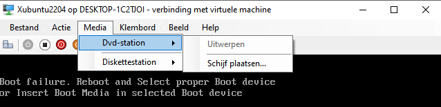

*Schijf plaatsen*, *isootje aanklikken*, ...

En wist je dat we onze VM-instellingen vanuit nóg een manier kunnen openen?

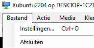

En kijk: de DVD-speler die eerder nog leeg was, bevat nu een virtueel DVDtje:

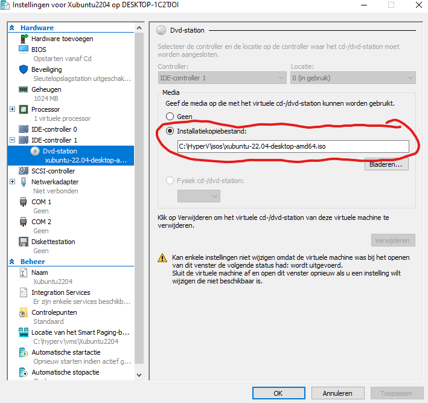

> Let ook op de melding met het uitroepteken dat we niet *alle* instellingen van de VM momenteel kunnen veranderen omdat de machine draait. Sommige dingen lukken echter wel, zoals (uiteraard) het verwisselen van een dvdtje.

Et voilà!

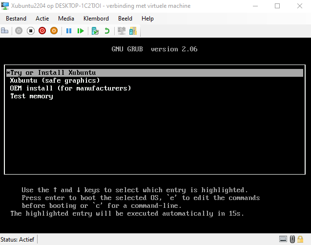

Maar wat is dit? En hola, er telt iets af!

Binnen enkele seconden zal automatisch de eerste keuze (**Try or Install Xubuntu**) worden uitgevoerd. De ongeduldigaards kunnen op ENTER drukken. De nieuwsgierigaards kunnen zelf proberen wat b.v. **Test memory** doet. De luiaards kunnen gewoon afwachten en kijken wat er gebeurt...

> Bovenaan zie je `GNU GRUB` staan. Grub is de **bootloader** die de meeste Linux-distributies gebruiken. Concreet zitten we nu dus in de situatie dat het BIOS **iets bootable** (nl. GRUB) ontdekt heeft op deze dvd. GRUB is een klein programmaatje dat vnl. als doel heeft om het echte OS op te starten maar er zijn ook nog enkele andere keuzes die je kan maken (zoals *Test Memory*). Mits voldoende kennis zou je mischien zelf ooit een bootable iso kunnen maken waarop dan GRUB zodanig geconfigureerd staat dat je een zogenaamde **multi-boot**-DVD maakt, waarmee je dan verschillende OS's kan opstarten! Of je kan gewoon eens Googlen naar iets als `multiboot usb` en de vruchten plukken van het werk dat iemand anders al gedaan heeft.

Zowaar verschijnt even later het logo van Xubuntu:

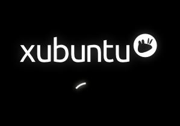

> En even later draait er een totaal ander guest-OS in een VM bovenop de Hyper-V hypervisor terwijl tegelijkertijd uiteraard ons host-OS gewoon blijft verder werken (eigenlijk ook op dezelfde hypervisor).

Deze keuze verschijnt:
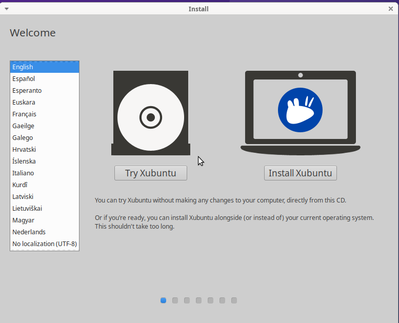

We kunnen hier enkel voor **Try Xubuntu** kiezen omdat we nog geen schijf aan onze VM gekoppeld hebben waarop we Xubuntu *definitief* zouden kunnen installeren.

> Het is in de wereld v.d. gebruiksvriendelijke Linux-distributies vrij normaal dat een installatie-CD ook gewoon een werkend OS kan opstarten zonder dat een echte installatie op schijf nodig is. Hier kunnen de Windows-installatiemedia nog iets van leren!

Je zal misschien merken dat de bewegingen van de muis of andere zaken niet onmiddellijk vlot werken. Dit komt omdat OS's zoals Xubuntu eerst moeten gedetecteerd hebben dat ze als een Hyper-V VM zijn opgestart (net zoals ze anders zouden proberen de echte hardware te detecteren). Gelukkig is Hyper-V populair genoeg zodat de meeste Linux-distributies een goede ondersteuning bieden om te draaien als een Hyper-V VM.

> *Hé wat is dat met mijn muis binnen de VM? Als ik in de VM klik en de muis beweeg, hangt mijn muiswijzer vast binnen de VM!*

> Yep. Nu zal je wel blij zijn dat je die `CTRL-ALT-LINKS`-shortcut nog kent! Tenzij natuurlijk Xubuntu ondertussen door heeft dat het in Hyper-V draait en een betere werking van de muis inschakelt.

# Play! Of toch niet?
Als je geluk hebt, werkt de *LiveCD/Try*-versie van Xubuntu *out-of-the-box*. Exploreer de UI een beetje. Speel een spelletje. Start een teksteditor of misschien zelfs een tekstverwerker of spreadsheet (zoals die van LibreOffice). 

Of had je bij de keuze van het netwerk gekozen voor **Niet verbonden**? Dan kan je nu misschien eens kiezen voor de **Default Switch** en een webbrowser uitproberen!

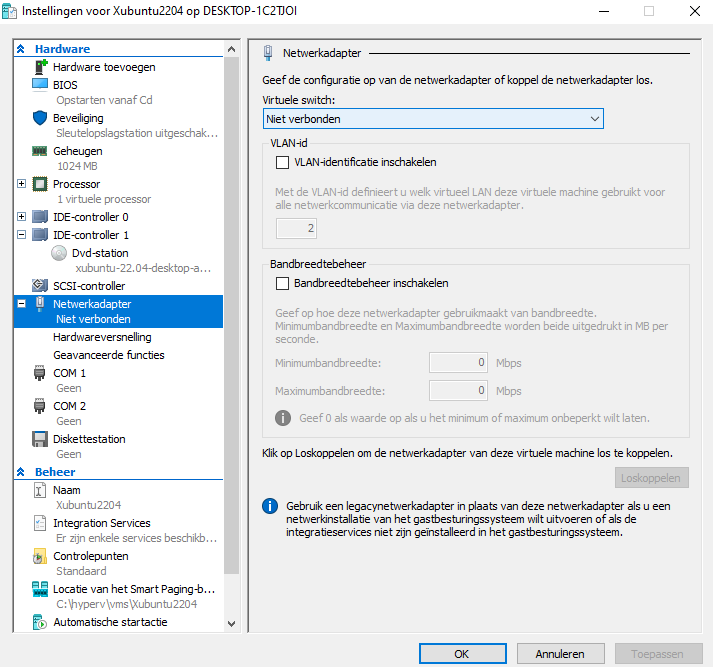

> Je kan zelfs van een **draaiende** machine een andere *virtuele switch* kiezen. Dit is immers hetzelfde als het **inpluggen van een netwerkkabel** in een ander apparaat: iets wat je ook kan doen bij een draaiende PC of laptop. Het hangt dan wel van allerlei factoren (instelling van het gast-OS, configuratie van een DHCP-server, ...) af of dit meteen zal werken maar **vaak is geen herstart** nodig wanneer je de *Default Switch* inplugt.

Werkt het toch niet? Krijg je een zwart scherm? Misschien heb je net pech met deze specifieke Linux-versie van een bepaalde Linux-distro of meerbepaald met de grafische schil ervan. Je hebt meer kans op succes wanneer je kiest voor een Linux-distro die focust op LiveCD's (en niet een combinatie van LiveCD en installer) en nog meer kans met een tekst-gebaseerde Linux-distro's i.p.v. (gebruiksvriendelijke) distro's met een GUI.

Geef daarom niet op en probeer enkele andere `.iso`'s, zoals ééntje uit één van deze lijsten: 

- https://en.wikipedia.org/wiki/List_of_live_CDs
- https://www.linux.com/training-tutorials/five-best-linux-live-cds/
- https://livecdlist.com/
- ...

Je zal merken dat een aantal van deze distro's zich profileren als een **rescue-disk**, bedoeld om een PC die niet meer opstart nog te redden of om gegevens van een harde schijf van zo'n PC nog op een USB-disk te kunnen zetten! Uiteraard moet je voor een échte *rescue-operatie* dan wel een **echte bootable USB-disk** maken, waarvoor je dan weer tooltjes nodig hebt zoals:

- https://rufus.ie/nl/
- https://www.balena.io/etcher/
- https://unetbootin.github.io/
- ...


Hopelijk heeft deze oefening je wat inspiratie gegeven om zelf verder te exploreren!

# Conclusies
Je kent nu het belang van de **basisinstellingen van een VM**, zoals enkele elementaire hardware-instellingen en de **automatische start- en stop-acties** en de (automatische) **controlepunten**.

Met onze exploraties van de configuratiebestanden (in onze **ordelijke mappenstructuur**) en de random (*UUID*-)mapnamen die Hyper-V gebruikt, hebben we laten zien dat het belangrijk is dat VM's een uniek **ID** hebben en dat we hier best aandacht voor hebben, zeker als we VM's zouden gaan exporteren/importeren.

*Last but not least* heb je kennis gemaakt met **installatie-CD's**, **LiveCD's** en **rescue-CD's**. Je kent nu ook een werkwijze om van Internet gedownloade (bootable) `.iso`'s uit te testen op virtuele hardware, vooraleer je overgaat tot het maken van een fysieke **(installatie-/live-/rescue-)USB-disk**. Met zo'n bootable USB-disks in je *toolbelt*, ben je nu misschien wel in staat om (oude) computer-hardware te diagnosticeren en zelfs repareren!


