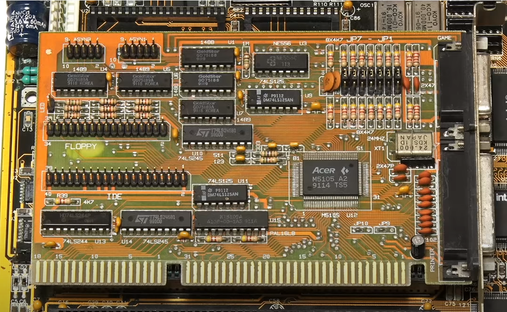

# Een geschiedenis van moederborden
Schijven worden aangesloten op schijf-controllers. Tegenwoordig zitten die schijfcontrollers meestal geïntegreerd op het moederbord terwijl hier vroeger nog aparte insteekkaarten voor werden gebruikt. Dit kunnen we ook vaststellen als we enkele moederborden inspecteren.

1. Moederbord 1: aparte IDE- en floppy-controller

Dit is een oud moederbord voor een 20 MHz 80386-CPU's uit 1991 waarop zelfs nog geen IDE-poorten te vinden zijn. Er is zelfs maar 1 externe aansluiting, nl. voor een toetsenbord.
Het RAM-geheugen bestaat uit SIMM-modules van b.v. elk 1 Mb.
In de lege IC-behuizing kon eventueel nog een extra co-processor worden geïnstalleerd.

Hoe sluit je er dan schijven (of floppy-drives en CD-ROM-spelers) op aan?
Via een aparte **I/O-uitbreidingskaart**!

 

Deze uitbreidingskaart (met een 16-bit ISA-slot) heeft 2 externe aansluitingen (voor  b.v. een printer, een joystick of andere uitbreidingsapparten zoals een MIDI-interface voor muziekinstrumenten) en op de kaart zelf zie je de aansluitpinnetjes voor een floppy- of IDE-kabel. In de volgende afbeelding is zo'n floppy-kabel aangesloten.

In de volgende afbeelding zie je een gedeelte van een case van een andere 386-machine. De bovenste insteekkaart is de I/O-controller. Hiervandaan vertrekken kleine grijze flat-cables naar de buitenkant van de case (dit zijn 2 seriële poorten: `COM1` en `COM2`). De 2 grotere flat-cables vertrekken naar de bovenkant van de case waar ze worden aangesloten op de floppy- en IDE-drives (HD's of CD-ROM's). Onder de I/O-controller zie je nog 2 andere uitbreidingskaarten: een video-kaart (met VGA-aansluiting) en b.v. een ouderwetse *10base2*-netwerkkaart (voor een coax-netwerkkabel i.p.v. een TP-kabel.)

2. Moederbord 2: on-board IDE- en floppy-controller

Hier onder zie je een iets moderner moederbord uit 1999 met een Intel Pentium II CPU. Speciaal aan de Pentium II-processoren is dat ze op een apart printplaatje in een *slot* werden aangesloten i.p.v. als een IC dat in een *socket* past.

Aan de rechterkant zie je (van rechts naar links) 2 IDE-poorten en 1 poort voor een floppy-drive. (Daarnaast staan de DIMM-sloten voor het RAM-geheugen.) Er zijn 2 (zwarte) ISA-, 4 (witte) PCI-uitbreidingssloten en 1 (bruin) AGP-uitbreidingsslot voor een videokaart.

Onderaan zie je een EEPROM-chip met een *Award*-sticker op. Dit is het BIOS. Rechts daarboven zie je ook een klein blauw blokje met *dipswitches*. Dit moederbord stamt immers nog uit een periode dat niet alle hardware-instellingen via het BIOS konden worden ingesteld maar je soms nog kleine schakelaartjes (de *dipswitches*) moest verzetten. 

Er is maar externe connector op het moederbord vast gesoldeerd, nl. voor een toetsenbord. Op één van de andere connectoren kan wel met een *break-out-cable* een USB-poort worden aangesloten.

3. Moederbord 3:  on-board IDE- en floppy-controller + meer externe aansluitingen

We zien een full-size ATX-moederbord uit 2004 met Pentium 4 CPU (3 GHz). Er is nog steeds een floppy-controller en 2 IDE-poorten en er zijn 2 (oranje) SATA-aansluitingen rechts bovenaan.

Externe aansluitingen zijn er voor PS/2-toetsenborden en -muizen, 4 USB-poorten, een netwerkadapter, een geluidskaart en ook nog steeds een ouderwetse parallele printerpoort en 2 ouderwetse seriële poorten (`COM1` en `COM2`).

4. Moederbord 4: alles on-board (inclusief SATA, VGA, ...)

Een kleiner (micro-ATX) moederbord uit 2010 waar links onderaan 3 (blauwe) SATA-connectoren te zien zijn. Er draait een quad-core waarvan elke core een kloksnelheid van 2.4 GHz heeft. Er is toch ook nog 1 IDE-connector en links boven zien we nog steeds een FDD (Floppy Disk Drive) connector.

Aan de achterkant zien we een o.a. VGA- en RJ45-netwerkconnector vast gesoldeerd op het moederbord wat er op wijst dat er een VGA-controller en netwerkkaart geïntegreerd aanwezig zijn.

5. Moederbord 5: M.2-interface voor SSD's

Ongeveer in het midden van dit moederbord uit 2016 zien we een M.2-aansluiting. M.2 is een compact connector-type voor moderne SSD's dat intern gebruik maakt van 2 mogelijke technologieën:

- SATA
- NVMe (PCI-express)

Er zijn SATA-poorten aanwezig (moeilijk te zien op de afbeelding) maar het valt op dat hier geen floppy- of IDE-controllers of seriële poorten meer aanwezig zijn. Dit is dus het eerste moederbord dat we in Hyper-V zouden aanduiden als een **Generatie 2**-systeem.

> Screenshots afkomstig van https://www.youtube.com/watch?v=sewt2pqc3us

# IDE- en SCSI-controllers in Hyper-V
Dankzij deze geschiedenis van enkele moederborden begrijpen we waarom een Gen2-VM geen IDE-controller meer heeft.

We kunnen er uit afleiden dat moderne controllers zoals voor **SATA** (of M.2 met PCI-e) in Hyper-V worden beschouwd als **SCSI-controllers**.

We gaan niet dieper in op de geschiedenis v.d. SCSI-interface. Het is genoeg dat je weet dat dit ook vroeger een alternatief was voor IDE dat hogere snelheden haalde en soms in meer professionele toestellen (oude servers) werd gebruikt.

Hier zie je enkele ouderwetse SCSI-aansluitingen:

> Screenshot afkomstig van https://www.youtube.com/watch?v=bhG4JZo07m8

