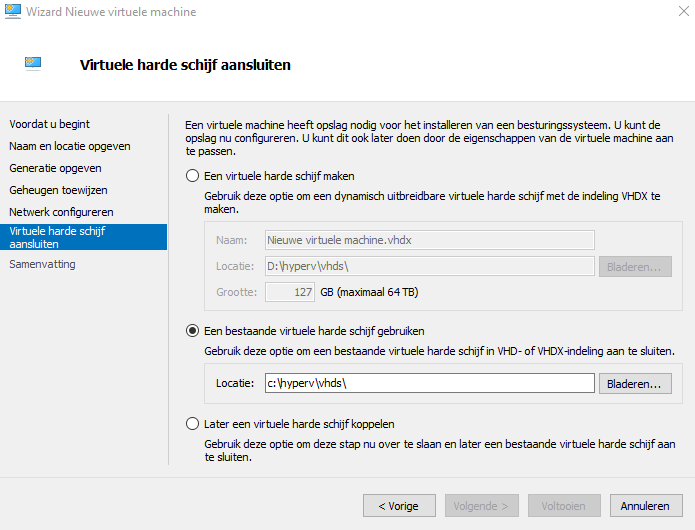

# VM op basis van bestaande VHDX
Een VM toevoegen aan een Hyper-V-server op basis van een voorafgemaakte VHDX.

# Windows Server 2016 Core
Hier kan je een voorgeïnstalleerde Windows Server 2016 Core-editie downloaden:
https://drive.google.com/drive/folders/1hwdA2nZcKnQdli6v9exn8As_CSaTd6hy?usp=sharing

> In het `.txt`-bestand staat de nodige info maar we vatten het hier nog eens samen:
> - Het wachtwoord van de Administrator is `AdmPass0` en er wordt verwacht dat je dit op een `nl-BE`-toetsenbord (azerty) intypt. Op een qwerty-toetsenbord wordt dit wachtwoord `Qd;Pqss)`.
> - Er werden o.a. Sysinternals-tools en Wireshark geïnstalleerd in de map `C:\TOOLS`.
> - `Update-Help` werd uitgevoerd terwijl er een Internet-verbinding was, zodat de help-teksten van de meeste Powershell-commando's offline kunnen worden geraadpleegd.

# Stappenplan

- Pak het `.7z`-bestand uit en zet het `.vhdx`-bestand op een goede plaats in je mappenstructuur (b.v. `C:\HyperV\vhds\`).
- Zet het `.txt` bestand best met details over wat op de VHD staat, best in dezelfde map als de `.vhdx`.
- Lees de bijgevoegde `.txt` voor belangrijke informatie over wat op de VHD staat en/of hoe ze gemaakt is.

- Maak een nieuwe VM (met de juiste instellingen).
- Wanneer de wizard vraagt om een schijf, voeg je de bestaande `.vhdx` toe. Of je kan natuurlijk de schijf later pas koppelen via de instellingen.

OPGELET: wanneer je 2 VM's op basis van deze schijf wil maken, moet je **een kopie maken** van de schijf. Een virtuele HD kan net zoals een echte HD niet aan 2 machines tegelijk aangesloten zijn.

> In principe kán je een VHD wel koppelen aan 2 VM's maar dan zal je de VM's nooit gelijktijdig kunnen opstarten. Bovendien kan het verwarrend zijn als de inhoud van de schijf veranderd kan worden door 2 verschillende VM's.

- Zoals steeds, zet je de **start- en stop-acties** van de VM goed.
- Zoals steeds, zet je best **automatische controlepunten** uit.
- Maak misschien wel **handmatig een controlepunt** (b.v. met de naam **`origineel`**) voor je de machine opstart.
- Start de machine!

